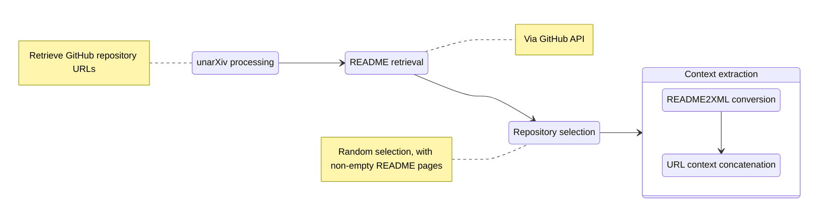

---
# You can also start simply with 'default'
theme: academic
layout: cover
coverBackgroundUrl: /GESIS-background.png
coverDate: 25/08/2024

title: Hidden Entity Detection from GitHub Leveraging Large Language Models
info: |
  Lu Gan, Martin Blum, Danilo Dessi, Brigitte Matthiak, Ralf Schenkel, Stefan Dietze

  Workshop at KDD24 on Deep Learning and Large Language Models for Knowledge Graphs
# apply unocss classes to the current slide
author: Lu Gan

class: text-white
# https://sli.dev/custom/highlighters.html
highlighter: shiki
# https://sli.dev/guide/drawing
drawings:
  persist: false
# slide transition: https://sli.dev/guide/animations#slide-transitions
transition: slide-left
# enable MDC Syntax: https://sli.dev/guide/syntax#mdc-syntax
mdc: true 
---

## Hidden Entity Detection from GitHub Leveraging Large Language Models

<ins>Lu Gan</ins>, Martin Blum, Danilo Dessi, Brigitte Matthiak, 
Ralf Schenkel, Stefan Dietze

<br>
<br>
Workshop at KDD24 on Deep Learning and Large Language Models for Knowledge Graphs


<div class="abs-br m-6 flex gap-2">
  <button @click="$slidev.nav.openInEditor()" title="Open in Editor" class="text-xl slidev-icon-btn opacity-50 !border-none !hover:text-white">
    <carbon:edit />
  </button>
</div>

<!--
The last comment block of each slide will be treated as slide notes. It will be visible and editable in Presenter Mode along with the slide. [Read more in the docs](https://sli.dev/guide/syntax.html#notes)
-->

---
layout: two-cols-header
transition: fade-out
---

<h1>Motivation</h1>
::left::
  <h3 center>Knowledge Graph Construction</h3>
  
  <p>Knowledge graph construction is a vital task across diverse domains for organizing entities and their relations.</p>

  - Tasks involved in KG population include:
    - <span v-mark.red="2">Named Entity Recognition (NER)</span>
    - Relation extraction
    - Event extraction
  - Traditional supervised methods rely on domain-specific labeled data
    - **Large Language Models** (**LLMs**) are pretrained on extremely large corpora and show potential to various NLP tasks.
    - LLMs enable zeroshot learning (ZSL) or **fewshot learning** (**FSL**), beneficiating scenarios with limited training data. 


::right::
  <h3>Dataset and Software Discovery</h3>
  <p>Scholarly artifacts such as datasets and software are important to progress research reproducibility. </p> 

  - Lack of standardization in releasing research related software and datasets 
  - Overlooking resources like **datasets** and **software** linked to research papers
  - In addition to research papers, research-related webpages can also serve the same purpose, e.g. GitHub repositories.

  <br>
  <br>
  <div class="m-10 overflow-auto max-h-160 max-w-140">
  <span v-mark.red="1"> <b>RQ 1</b>: Can LLMs help dataset and software discovery from sources like GitHub repositories?</span>
  <br>
  <span v-mark.red="2"> <b>RQ 2</b>: Targeting at searching scholarly artifact, can we find non-named entity dataset/software information? </span>
  </div>

<!--
Here is another comment.
-->

---
layout: two-cols-header
transition: slide-up
---

# Tasks 


::left::

<span style="display:block;margin-right:40px;" class="note">

Aiming at classifying URLs in a given context, we define two subtasks leveraging LLMs. Each task is composed of the system message, the definition of the task, the demonstrations and finally the specific context for LLM to generation the answer. 
<br>

### Subtask 1: Extraction and Classification (E+CL)
<p m-1>LLMs are instructed to both extract URLs and classify them into predefined classes in the given context.</p>

<br>

### Subtask 2: Classification (CL) 
<p m-2>LLMs are instructed to classify the URLs only given the context and the URL.</p>


</span>

::right::

<!--div class="b-container" -->


<arrow v-click="3" x1="500" y1="440" x2="650" y2="245" color="#564" width="2" arrowSize=".5" />

<p v-click>The URL <code>https://github.com/acl-org/acl-anthology</code> is one example to be classified in our <span v-mark.red="3">tasks</span>. </p>

<!--/div-->

---
layout: default
Background: /Teams-Hintergrund-dunkel-Häuser.png
transition: fade
---

# Dataset  Creation

We use GitHub repositories extracted from the *unarXiv* corpus [^1] and randomly sample 811 GitHub repositories containing 1,439 URLs and their corresponding contexts in README files. 

<v-click>

</v-click>

<v-click>
After the context extraction, each URL with the given context is manually labeled into one of four classes:

  - **Dataset Direct Link**: URLs pointing directly to dataset files or archives.
  - **Dataset Landing Page**: URLs leading to index pages, directories, or GitHub repositories containing datasets.
  - **Software**: URLs directing to software snippets, notebooks, or source code repositories.
  - **Other**: URLs not falling into the above categories. Examples can be blog posts, video links, etc.

</v-click>


<!-- Footer -->
[^1]: [unarXiv corpus on GitHub](https://github.com/IllDepence/unarXive)

<!-- Inline style -->
<style>
.footnotes-sep {
  @apply mt-5 opacity-10;
}
.footnotes {
  @apply text-sm opacity-75;
}
.footnote-backref {
  display: none;
}
</style>

<!--
Notes can also sync with clicks

[click] This will be highlighted after the first click

[click] Highlighted with `count = ref(0)`

[click:3] Last click (skip two clicks)
-->

---
layout: two-cols-header
layoutClass: gap-16
zoom: 1
---

# LLMs, prompt settings and prompt templates
We use **LLaMA 2** , **Mistral 7B** and their quantized 4-bit models for each task. 
For each task, we apply **static** and **dynamic** demonstration settings, where the demonstrations in static setting are fixed and selected according to *context similarity* in dynamic setting.
::left::
<div class="overflow-auto max-h-160 max-w-140">
<!--div col-1 gap-1 mt-4-->
Prompt for E+CL task: 
```ts {3,10,11,15,16} {lines:true, maxHeight:'100px'}
<s>[INST]<<sys>>You act as a human annotator. First read the instructions and given examples, then only annotate the last given input accordingly without extra words. Your annotation has to use valid JSON syntax.<</sys>>
    
Annotate the URLs in the input and classify the URLs with the following labels: 
1. DatasetDirectLink - the URL is for downloading dataset files
2. DatasetLandingPage - the URL is an introduction or a landing page for some dataset entity
3. Software - when the URL is for some software entity
4. Other - the URL does not fall into the above cases
    
# formatting
Input: text containing one or more URLs.
Output: for each URL span, first output the URL span, then output one of the four above labels.
    
# Examples:
# Example 1:
Input: Gowalla https://snap.stanford.edu/data/loc-gowalla.html : the pre-processed data that we used in the paper can be downloaded here http://dawenl.github.io/data/gowalla_pro.zip .
Output: [{"URL": "https://snap.stanford.edu/data/loc-gowalla.html", "label":"dataset_landing_page"},{"URL": "http://dawenl.github.io/data/gowalla_pro.zip", "label": "dataset_direct_link"}]
...
```

</div>

::right::
<div class="overflow-auto max-h-160 max-w-140">
Prompt for CL task: 

```ts {3,10,11,15,16} {lines:true, maxHeight:'100px'}
<s>[INST]<<sys>>You act as a human annotator. First read the instructions and given examples, then only annotate the last given input accordingly without extra words. Your annotation has to use valid JSON syntax.<</sys>>
    
Annotate the URLs given in the input with its context and classify the URLs with the following labels: 
1. DatasetDirectLink - the URL is for downloading dataset files
2. DatasetLandingPage - the URL is an introduction or a landing page for some dataset entity
3. Software - when the URL is for some software entity
4. Other - the URL does not fall into the above cases
    
# formatting
Input: target URL(s) with context 
Output: for each URL span, first output the URL span, then output one of the four above labels.
    
# Examples:
# Example 1:
Input: {"context": "Gowalla https://snap.stanford.edu/data/loc-gowalla.html : the pre-processed data that we used in the paper can be downloaded here http://dawenl.github.io/data/gowalla_pro.zip .","target_URLs": ["https://snap.stanford.edu/data/loc-gowalla.html", "http://dawenl.github.io/data/gowalla_pro.zip"]}
Output: [{"URL": "https://snap.stanford.edu/data/loc-gowalla.html", "label":"dataset_landing_page"},{"URL": "http://dawenl.github.io/data/gowalla_pro.zip", "label": "dataset_direct_link"}]
...
```

</div>

---
class: px-20
---

# Experiments

The generated output of LLMs first needs to be parsed and then evaluated for the E+CL and CL subtasks. 

<div grid="~ cols-2 gap-2" m="t-2">

<div grid="~ col-1 gap-1" mt-4>
<h3 font-bold>Postprocessing - output Parsing</h3>
<p m-2>LLMs are instructed to output valid JSON format, but generation does not guarantee such format. Therefore, we parse the output with the following steps: </p>
<div class="overflow-auto max-h-160 max-w-100">

- Remove additional opening phrases
- Consolidate JSON format
- URL matching to deal with multiple-URL output

</div>
</div>

<div grid="~ col-1 gap-1" mt-4>
<h3 font-bold>Evaluation Setting</h3>
<div class="overflow-auto max-h-160 max-w-120">

- Metrics: **Precision** and **Recall** 
- **Prediction-groundtruth URL matching**: for context containing multiple URLs, we use bipartite matching to put prediction URL and ground-truth URL into evaluation pairs. 
- Four evaluation modes are used:
  - **Strict**: both URL span and URL type should match the gold standard annotation
  - **Exact** : URL span should match the annotation
  - **Partial**: URL span should partially match the annotation
  - **Type**: URL type should match the annotation

</div>
</div>
</div>


---
src: pages/diagrams.md
hide: true


---
transition: slide-left

---
class: center
hide: false
---
# Results

<div container align="center">
    <div item>
        
    </div>
    <div text-xl>
        <carbon:arrow-up /> LLM output string parsing statistics. 
        <br>
        The generation output parsing ratio for fewshot setting are all > 85%. 
    </div>
</div>


---
transition: slide-left

---
class: center
hide: false
---
# Results

<div container align="center">
    
    <div text-xl>
        <carbon:arrow-up />Performance on the E+CL subtask. P and R represent precision and recall ;<br> b refers to the binary results (whether the URLs are related to datasets). 
    </div>

</div>

---
src: pages/CL-results.md
hide: true
---


---
layout: center
---

<h1 m-5>Conclusion and Future Work</h1>

To conclude, 
- The four LLMs present limited parsing capabilities.
- There exist prompt following issues.
- No obvious different results between the E+CL and CL tasks.

For future work,
- Optimize annotation schema: <br> it may be too difficult to distinguish dataset landing page from dataset direct link based on context.
- Link the URLs to corresponding named entities.

---
layout: image
image: /GESIS-background-lastpage.png
backgroundSize: contain
class: text-center
---

<div class="center">

<AutoFitText :max="60" :min="60" modelValue="Q&A"/>
</div>

---
layout: index
indexEntries:
  - { title: "GitHub", uri: "https://github.com/alexanderdavide/slidev-theme-academic" }
  - { title: "npm", uri: "https://www.npmjs.com/package/slidev-theme-academic" }
  - { title: "Slidev", uri: "https://sli.dev" }
indexRedirectType: external
hide: true
---

# References

Here is the list of citations mentioned in the presentation.


---
layout: dynamic-side-image
image: images/README_example.png
equal: false
hide: true
---

## Test dynamic image layout

<div class="overflow-auto max-h-30 max-w-100">
// 

``` ts
# Examples:
# Example 1:
Input: {"context": "Gowalla https://snap.stanford.edu/data/loc-gowalla.html : the pre-processed data that we used in the paper can be downloaded here http://dawenl.github.io/data/gowalla_pro.zip .","target_URLs": ["https://snap.stanford.edu/data/loc-gowalla.html", "http://dawenl.github.io/data/gowalla_pro.zip"]}
Output: [{"URL": "https://snap.stanford.edu/data/loc-gowalla.html", "label":"dataset_landing_page"},{"URL": "http://dawenl.github.io/data/gowalla_pro.zip", "label": "dataset_direct_link"}]

...
```
// 
</div>
